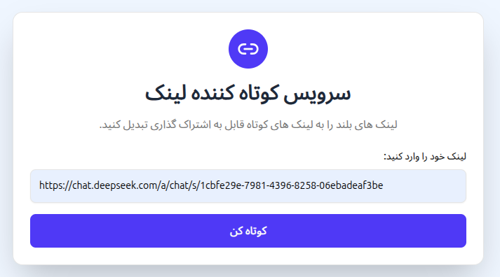
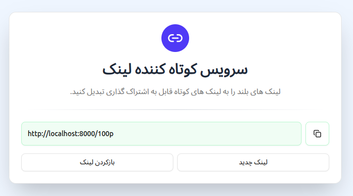

## 🖼️ Screenshots

<p align="center">
  
</p>

<p align="center">
  
</p>

## 🛠️ Tech Stack

### **Backend**

- **Library:** FastAPI (Python)
- **Database:** PostgreSQL
- **ORM:** SQLAlchemy
- **API Documentation:** Auto-generated OpenAPI docs

### **Frontend**

- **Library:** React + Vite
- **Language:** TypeScript
- **Styling:** Tailwind CSS / Shadcn components

## 🚀 Quick Start

### **Backend Setup**

1. **Create and activate virtual environment:**

   ```bash
   python -m venv venv
   # On macOS/Linux:
   source venv/bin/activate
   # On Windows:
   venv\Scripts\activate
   ```
2. **Install dependencies:**

   ```bash
   pip install -r requirements.txt
   ```
3. **Environment configuration:**

   ```bash
   cp .env.example .env
   ```

   Edit `.env` with your database credentials and other configuration.
4. **Start the development server:**

   ```bash
   uvicorn app.main:app --reload
   ```

The API will be available at `http://127.0.0.1:8000`

### **Frontend Setup**

1. **Navigate to frontend directory:**

   ```bash
   cd ui
   ```
2. **Install dependencies:**

   ```bash
   npm install
   ```
3. **Start development server:**

   ```bash
   npm run dev
   ```

The React application will open at `http://localhost:3000`

## 📚 API Documentation

Once the backend is running, access the interactive API documentation:

- **Swagger UI:** `http://127.0.0.1:8000/docs`
- **ReDoc:** `http://127.0.0.1:8000/redoc`
